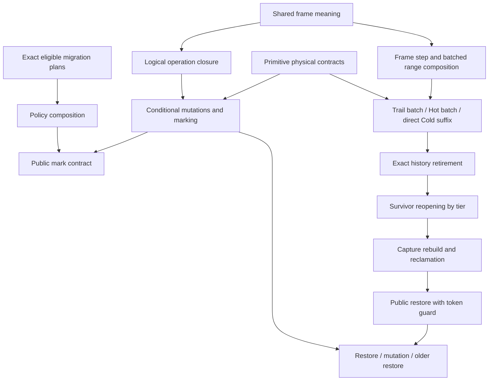

# Conditional top-down proof target

This target implements the workflow in
[three-tier-top-down-proof-engineering.md](../../doc/tasks/three-tier-top-down-proof-engineering.md).
It is **not imported by the production crate**. Its `Runtime`, `Mutations`, and
`Policies` traits have only a mathematical consistency implementation in
`witness.rs`. Their methods are explicit conditional premises for production,
not trusted production wrappers. No `assume`, `admit`, or
`external_body` is used here.

## Current status

The draft composition verifies with the project's pinned Verus:

```sh
verus --crate-type lib containers-verus/proofs/top_down/composition.rs
```

Result on 2026-09-15: **59 verified, 0 errors**, Verus
`0.2026.08.02.b677dd5`, Rust 1.97.1. The target needs only the bundled vstd and
does not change Cargo's production build or its verification counts.

The conditional milestone is **still in progress**. Before freezing interfaces:

1. Review the verified mathematical consistency witness. It implements every
   provisional method using map storage, so these contracts are jointly realizable.
   It does not discharge the production encodings, index limits or token semantics.
2. Finish local encoding and pool-builder contracts underneath completed migration;
   audit exact unchanged-prefix and source-to-plan obligations.
3. Review canonical-history and physical-prefix projections against the original
   public contracts. They are opaque interface obligations here, not erased duties.
4. Connect encoded duplicate-capture witnesses to the representation interfaces.
   Existing mathematical witnesses already check saved lengths 3,1,3,2,2; zero,
   Cold, Hot and Trail survivor cases; both disciplines and flag protocols; an
   empty sealed frame migrating through Hot/Cold and reopening; repeated first
   capture; active-domain pop/regrowth; and all policy families.
5. Review errors and token construction against concrete APIs. This target retains
   a separate public validity predicate and does not invent genealogy rules.
6. Then classify existing proofs as reuse, adapt, or replace. Do not weaken this
   theorem to fit an existing proof. Remove superseded proofs only after their
   replacements verify.

Production code and existing proofs were preserved at signed local commit
`07b6df8`. Its complete gates passed: 2310 Verus obligations in both configurations,
277 feature tests, four 1024-case policy-matrix tests, and 1267 consumer tests.
Nothing was pushed. This target's result is separate from that runtime evidence.

## Checked layers

| File | Checked result |
|---|---|
| `model.rs` | Finite partial-map frame meaning; captured-or-inherited invariant; constructor/set/push/pop/mark/restore closure; arbitrary legal action-sequence closure; mutation after restore; pop/regrowth; frame step; range composition; reconstruction with arbitrary resized filler and saved-length zigzags |
| `composition.rs` | Conditional resize/preparation, one batch per pair tier, direct Cold-frame suffix, physical/canonical retirement, survivor-tier dispatch, capture finalization, reclamation, valid public restore, unchanged state on invalid restore |
| `mutation.rs` | Conditional capture/raw-write composition, push/tag repair, capture/pop composition with returned value, mark preparation/opening, constructor, restore–write–restore |
| `policy.rs` | Plans name exact oldest eligible frame meanings; active ingress excluded; staged Trail then Hot policy composition; mark/token coordinate composition; unchanged state on rejected mark |
| `witness.rs` | Checked mathematical implementation of every provisional method and explicit nontrivial history/promotion/regrowth/policy witnesses; not a production adapter |

`Model` and `Frame` are mathematical proof values. They add no persistent ghost
fields and perform no runtime lookup for Trail's first capture. A concrete
adapter must derive their maps from physical history. Equality of frames includes
both map membership and saved values, as well as each independent saved length.

`Stable` combines physical boundaries, snapshot semantics, writable ingress,
active saved length and exact live-tag/map membership. During replay it is
intentionally absent: frozen source history and physical/store validity suffice.
The proof never assumes monotone saved lengths.

## Provisional contract inventory

Every row below is conditional. Existing implementations are candidates only;
no `Runtime` implementation connects them to this target yet. Classification is
deliberately deferred until the interfaces pass the review above.

| Interface | Concrete candidates | Required transition / next consumer |
|---|---|---|
| View and named boundaries | `Vec::wf`, named representation predicates, `frame_saved_value`, `frame_partition_ok`, canonical fields | Derived per-frame map, saved length, exact physical/canonical projections; supplies all primitive premises |
| `token_bounds` | `is_restorable_spec`, `is_valid_token` | Full public validity implies frame bounds; supplies resize and reconstruction |
| `resize` | `DiffStore::resize_default`, `reconstruct_target_checked` | Fixed target length, shared-prefix equality, source unchanged, flags inherited only from pre-state |
| `prepare` | `runtime_begin_restore` and store capture protocols | Non-fused flags clear; fused flags retained as subset until first ingress batch |
| `pair_batch` | `replay_pair_suffix_checked` / `replay_all_tiers_checked` | Exact `apply_range`, fixed length, physical source equality, flags clear; feeds next tier |
| `cold_frame` | `replay_cold_frame_checked`, store run-replay primitives | Exact single-map application directly to live storage, clear flags preserved |
| `retire` | `truncate_restored_history_checked` | Exact physical/canonical prefixes, exact retained frame meanings, tier counts and target contents; feeds reopening |
| `reopen_hot` | `promote_hot_survivor_checked` | Only newest Hot frame moves to Trail; same map/domain/length; older storage unchanged |
| `reopen_cold` | remaining `runtime_promote_survivor` Cold branches | Only newest Cold frame decoded to selected writable tier; same map/domain/length; older storage unchanged |
| `finish_capture` | `finish_survivor_checked` | Derive active length and tags from writable map, preserving live/history/protocol |
| `finish_empty` | zero-depth restore finish | Empty history, zero active length, no flags, stable boundary |
| `reclaim` | `reclaim_cold_checked` | Preserve model, flags, protocol and canonical history under capacity changes |
| `construct` | constructors and store constructors | Empty history with specified live contents and selected capture discipline |
| `capture_cell` | `runtime_capture`, Trail append, Hot capture | Physical capture realizes `capture_first`; older maps and snapshots unchanged; live unchanged |
| `raw_write` | `DiffStore::set` family | Exact live update after necessary capture; preserve history and tags |
| `raw_pop` | `DiffStore::pop` family | Remove last value/tag after necessary capture; preserve history |
| `raw_push` | `DiffStore::push` family | Append value and clear tag; maps unchanged, including regrowth |
| `finish_regrowth` | capture-bit restoration in push helpers | Only new cell's tag may need repair; prior coverage supplies saved value |
| `prepare_mark` | store `prepare_mark` / `runtime_push_frame` | Clear tags with valid sparse input; preserve contents/history and mark guards |
| `open_mark` | mark frame opening/sealing paths | Append empty frame and live snapshot before rollover; seal preceding writable frame |
| `select_plan` | configured/forced/adaptive policy selection | Exact source frame meanings, eligible count, source tier; supplies migration |
| `migrate` | Trail/Hot migration and adaptive-plan execution | Exact logical history, physical frame-count effects, stable physical/capture boundary; local transforms and pool rebasing still need interface review |
| `make_token` | `mark_with_options`, `mark` | Existing returned token coordinate; public validity remains a separate predicate |

`canonical_ok` must retain the existing canonical-history obligations, split
appropriately between structural/map correspondence and snapshot semantics.
`retired_prefix` and `older_storage_unchanged` must be instantiated as exact
physical relations. Giving these predicates vacuous definitions in a production
adapter would not meet the contract review requirements.

## Dependency graph



The completed all-tier and derived/parallel-container objective remains
unchanged. A conditional theorem is the interface-design milestone; concrete
discharge and public integration are still required.
